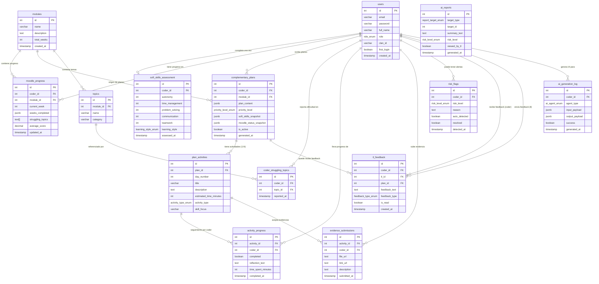
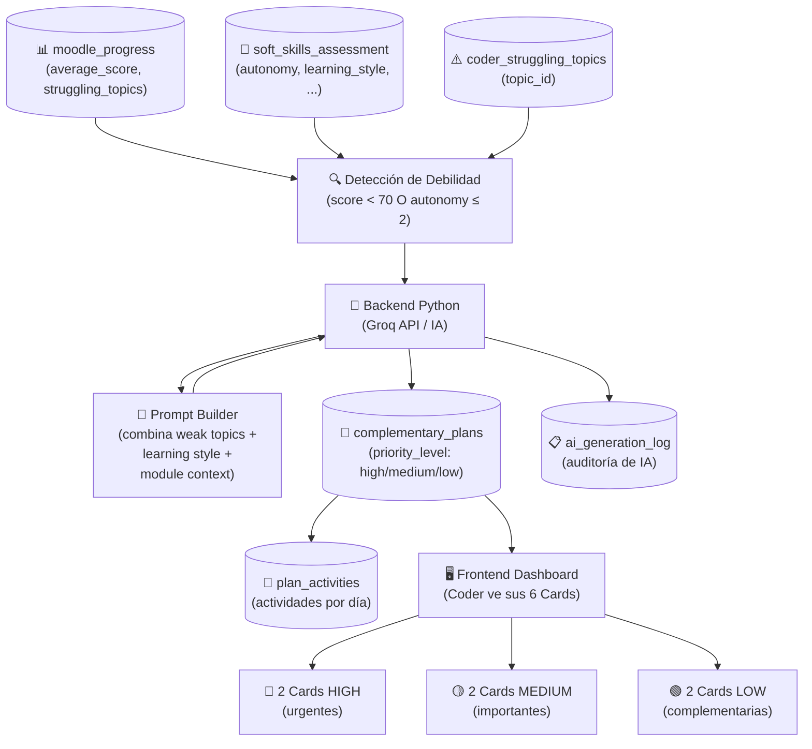
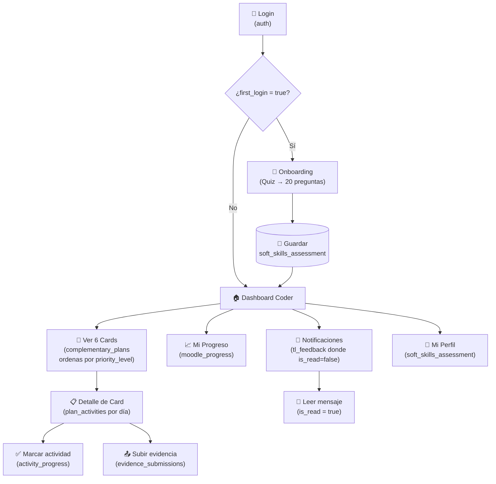
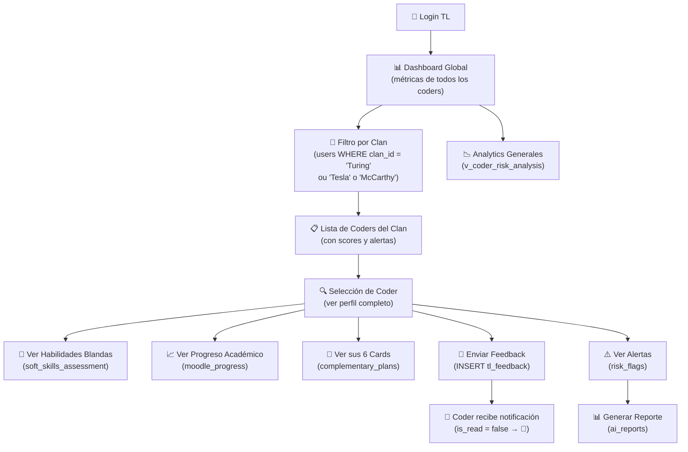
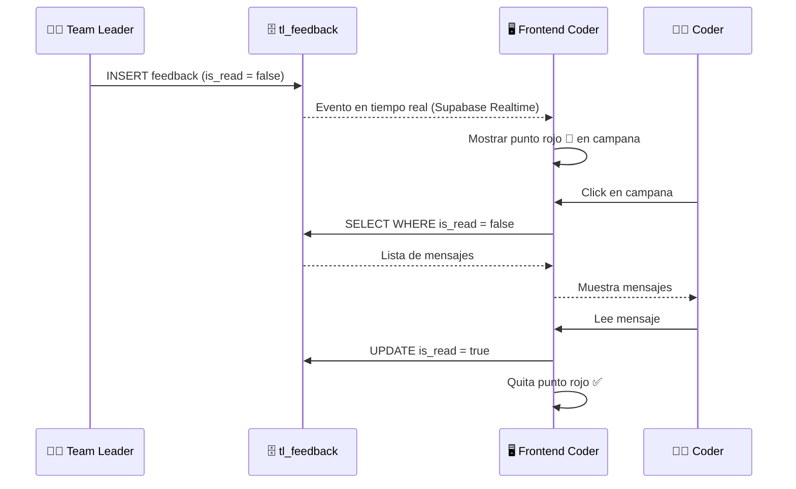
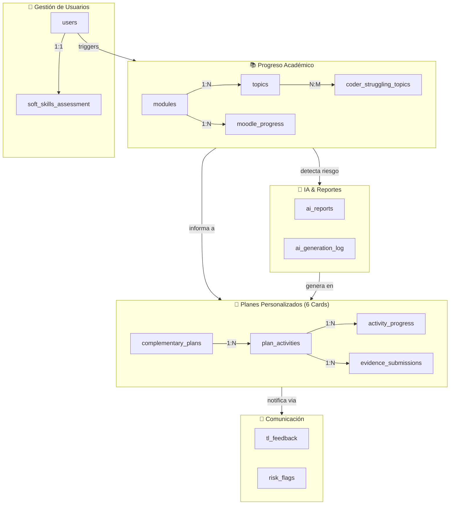

# Kairo — Architecture Documentation
## Database Design & Integration Diagrams

---

## 1. ERD — Entity Relationship Diagram

### Relaciones clave

| Relación | Tipo | Descripción |
|----------|------|-------------|
| `users` → `soft_skills_assessment` | **1:1** | Un coder tiene una sola evaluación |
| `complementary_plans` → `plan_activities` | **1:N** | Una card tiene múltiples actividades diarias |
| `users` → `complementary_plans` | **1:N** | Un coder puede tener hasta 6 plans activos |
| `users` (TL) → `tl_feedback` | **1:N** | Un TL envía múltiples feedbacks |
| `moodle_progress` → `complementary_plans` | Indirecto | El progreso bajo desencadena la generación de plans |

---

## 2. Data Flow Diagram — IA Integration

Muestra cómo el sistema detecta debilidades y genera planes personalizados.

### Paso a paso

| Paso | Qué pasa | Tabla involucrada |
|------|----------|-------------------|
| **1** | Sistema detecta `average_score < 70` o `autonomy ≤ 2` | `moodle_progress`, `soft_skills_assessment` |
| **2** | Se identifican `struggling_topics` del coder | `coder_struggling_topics` |
| **3** | Python recibe contexto completo (módulo, estilo, temas débiles) | — |
| **4** | Groq genera plan personalizado con prioridades | — |
| **5** | Se guardan 6 plans con `priority_level` (2H/2M/2L) | `complementary_plans` |
| **6** | Cada plan genera actividades diarias | `plan_activities` |
| **7** | Frontend muestra las 6 Cards al coder | — |
| **8** | Toda la operación queda en auditoría | `ai_generation_log` |

---

## 3. User Flow — Navigation Map

### Flujo del Coder

### Flujo del Team Leader

### Flujo de Notificaciones

---

## 4. Database Architecture Summary

---

## ENUMs Reference

| ENUM | Valores |
|------|---------|
| `role_enum` | `coder`, `tl` |
| `learning_style_enum` | `visual`, `auditory`, `kinesthetic`, `mixed` |
| `activity_type_enum` | `guided`, `semi_guided`, `autonomous` |
| `feedback_type_enum` | `weekly`, `activity`, `general` |
| `risk_level_enum` | `low`, `medium`, `high` |
| `priority_level_enum` | `low`, `medium`, `high` |
| `report_target_enum` | `coder`, `clan`, `cohort` |
| `ai_agent_enum` | `learning_plan`, `report_generator`, `risk_detector` |
