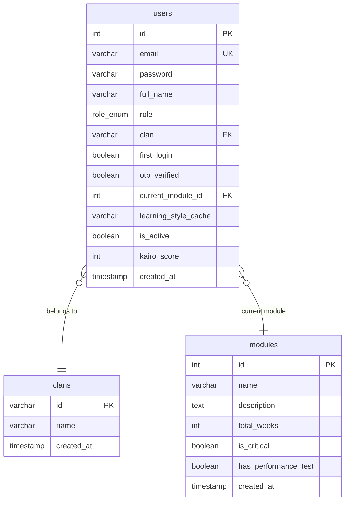
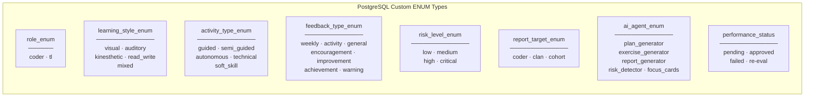

# Deliverable 1 — Relational Model + Data Dictionary

## Database Technical Documentation — Kairo

### Integrative Project · RIWI · Clan Turing · March 2026

---

## Table of Contents

1. [Relational Model Overview](#1-relational-model-overview)
2. [Data Dictionary](#2-data-dictionary)
3. [Enumerated Types (ENUMs)](#3-enumerated-types-enums)
4. [Security Policies (RLS)](#4-security-policies-rls)

---

## 1. Relational Model Overview

Kairo's database runs on **PostgreSQL 14+** hosted on **Supabase**. The final production schema contains **22 tables**, **8 custom ENUM types**, and uses **JSONB** extensively for AI-generated content.

The schema is divided into six functional blocks:

**Identity Block:** `users` is the central table. It stores both coders and team leaders, differentiated by the `role_enum` type. Each user belongs to a `clan` (varchar FK to `clans.id`). The `first_login` boolean controls whether the coder has completed onboarding. The `kairo_score` field (default 50) tracks platform engagement points.

**Academic Block:** `modules`, `weeks`, `topics`, and `moodle_progress`. This models the course structure: modules containing weeks, topics per module, and academic progress synced from Moodle. `moodle_progress` uses JSONB for `weeks_completed` and a PostgreSQL TEXT array for `struggling_topics`.

**AI Plans Block:** `complementary_plans`, `plan_activities`, `activity_progress`, and `evidence_submissions`. This is the core of the system. The AI generates a 20-day plan stored as JSONB in `plan_content`. The Python service then parses that JSONB and populates `plan_activities` row by row, making the data queryable. `completed_days` in `complementary_plans` tracks which days the coder has finished.

**Exercises Block:** `exercises` and `exercise_submissions`. Each exercise is cached per `(plan_id, day_number)` — a `UNIQUE` constraint ensures the LLM is never called twice for the same day. When a coder submits code, it goes into `exercise_submissions` for TL review.

**Resources & Feedback Block:** `resources`, `tl_feedback`, `assignments`, and `notifications`. TL-uploaded PDFs are stored in Supabase Storage with the path in `resources`. Notifications are delivered via SSE and stored here for persistence.

**Analytics Block:** `soft_skills_assessment`, `risk_flags`, `score_events`, `performance_tests`, `ai_generation_log`, and `ai_reports`. The `score_events` table is an immutable audit log — `users.kairo_score` is a denormalized aggregate for query performance.

### Schema Diagram



---

## 2. Data Dictionary

### 2.1 `users` — System Users

| Column                 | Type         | Constraints          | Description                                                        |
| ---------------------- | ------------ | -------------------- | ------------------------------------------------------------------ |
| `id`                   | SERIAL       | PK                   | Auto-increment primary key                                         |
| `email`                | VARCHAR      | UNIQUE, NOT NULL     | Institutional email address                                        |
| `password`             | VARCHAR(255) | NOT NULL             | bcrypt hash (10 rounds). OAuth users store `oauth_<provider>_<id>` |
| `full_name`            | VARCHAR      | NOT NULL             | User's full name                                                   |
| `role`                 | role_enum    | NOT NULL             | `coder` or `tl`                                                    |
| `clan`                 | VARCHAR      | FK → clans.id        | Clan identifier: turing, tesla, mccarthy                           |
| `first_login`          | BOOLEAN      | DEFAULT true         | Redirects to onboarding when true                                  |
| `otp_verified`         | BOOLEAN      | DEFAULT false        | Email verified via OTP                                             |
| `current_module_id`    | INT          | FK → modules.id      | Active module. Defaults to 4 (Databases)                           |
| `learning_style_cache` | VARCHAR      | NULL                 | Cached learning style for fast reads                               |
| `is_active`            | BOOLEAN      | DEFAULT true         | Soft-delete flag                                                   |
| `kairo_score`          | INT          | NOT NULL, DEFAULT 50 | Platform engagement score. Starts at 50, minimum 0                 |
| `created_at`           | TIMESTAMP    | DEFAULT NOW()        | Account creation timestamp                                         |

**Indexes:** `idx_users_email` (UNIQUE), `idx_users_clan`, `idx_users_role`

---

### 2.2 `clans` — Clan Registry

| Column       | Type      | Constraints   | Description                                  |
| ------------ | --------- | ------------- | -------------------------------------------- |
| `id`         | VARCHAR   | PK            | Clan identifier (e.g. `'turing'`, `'tesla'`) |
| `name`       | VARCHAR   | NOT NULL      | Display name                                 |
| `created_at` | TIMESTAMP | DEFAULT NOW() |                                              |

---

### 2.3 `soft_skills_assessment` — Soft Skills Diagnostic

| Column            | Type                | Constraints          | Description                                          |
| ----------------- | ------------------- | -------------------- | ---------------------------------------------------- |
| `id`              | SERIAL              | PK                   |                                                      |
| `coder_id`        | INT                 | FK → users, UNIQUE   | One assessment per coder                             |
| `autonomy`        | SMALLINT            | CHECK(1-5), NOT NULL | Derived from VARK + ILS quiz                         |
| `time_management` | SMALLINT            | CHECK(1-5), NOT NULL |                                                      |
| `problem_solving` | SMALLINT            | CHECK(1-5), NOT NULL |                                                      |
| `communication`   | SMALLINT            | CHECK(1-5), NOT NULL |                                                      |
| `teamwork`        | SMALLINT            | CHECK(1-5), NOT NULL |                                                      |
| `learning_style`  | learning_style_enum | NOT NULL             | visual / auditory / kinesthetic / read_write / mixed |
| `raw_answers`     | JSONB               | NULL                 | Raw quiz responses for audit                         |
| `assessed_at`     | TIMESTAMP           | DEFAULT NOW()        |                                                      |

**Index:** `idx_soft_skills_coder`

The Python AI reads this table to personalize plan generation. The weakest skill becomes `targeted_soft_skill` in `complementary_plans`.

---

### 2.4 `modules` — Bootcamp Modules

| Column                 | Type      | Constraints   | Description                                 |
| ---------------------- | --------- | ------------- | ------------------------------------------- |
| `id`                   | SERIAL    | PK            |                                             |
| `name`                 | VARCHAR   | NOT NULL      | e.g. "Bases de Datos", "JavaScript"         |
| `description`          | TEXT      | NULL          |                                             |
| `total_weeks`          | INT       | NOT NULL      | Module duration in weeks                    |
| `is_critical`          | BOOLEAN   | DEFAULT false | Flags modules requiring extra attention     |
| `has_performance_test` | BOOLEAN   | DEFAULT true  | Whether module has a final performance test |
| `created_at`           | TIMESTAMP | DEFAULT NOW() |                                             |

---

### 2.5 `weeks` — Module Weeks

| Column             | Type    | Constraints      | Description          |
| ------------------ | ------- | ---------------- | -------------------- |
| `id`               | SERIAL  | PK               |                      |
| `module_id`        | INT     | FK → modules     |                      |
| `week_number`      | INT     | NOT NULL         | 1-based week index   |
| `name`             | VARCHAR | NOT NULL         | Week theme name      |
| `description`      | TEXT    | NULL             |                      |
| `difficulty_level` | VARCHAR | DEFAULT 'medium' | easy / medium / hard |

---

### 2.6 `topics` — Module Topics Catalog

| Column      | Type         | Constraints  | Description                              |
| ----------- | ------------ | ------------ | ---------------------------------------- |
| `id`        | SERIAL       | PK           |                                          |
| `module_id` | INT          | FK → modules |                                          |
| `name`      | VARCHAR(200) | NOT NULL     | Topic name                               |
| `category`  | VARCHAR(100) | NULL         | e.g. "SQL", "JavaScript", "fundamentals" |

**Indexes:** `idx_topics_module`, `idx_topics_category`

---

### 2.7 `moodle_progress` — Academic Progress

| Column              | Type      | Constraints   | Description                     |
| ------------------- | --------- | ------------- | ------------------------------- |
| `id`                | SERIAL    | PK            |                                 |
| `coder_id`          | INT       | FK → users    |                                 |
| `module_id`         | INT       | FK → modules  |                                 |
| `current_week`      | INT       | NOT NULL      | Current week in module          |
| `weeks_completed`   | JSONB     | DEFAULT '[]'  | Array of completed week objects |
| `struggling_topics` | TEXT[]    | DEFAULT '{}'  | Free-text topics from Moodle    |
| `average_score`     | NUMERIC   | DEFAULT 0     | Moodle grade average (0-100)    |
| `updated_at`        | TIMESTAMP | DEFAULT NOW() | Last sync                       |

**Constraint:** `UNIQUE(coder_id, module_id)` — one row per coder per module.

**`weeks_completed` JSONB structure:**

```json
[
  { "week": 1, "score": 85, "completed": true, "struggling_topics": ["JOINs"] },
  { "week": 2, "score": 72, "completed": true, "struggling_topics": [] }
]
```

---

### 2.8 `complementary_plans` — AI-Generated Learning Plans

| Column                   | Type      | Constraints   | Description                                 |
| ------------------------ | --------- | ------------- | ------------------------------------------- |
| `id`                     | SERIAL    | PK            |                                             |
| `coder_id`               | INT       | FK → users    |                                             |
| `module_id`              | INT       | FK → modules  |                                             |
| `plan_content`           | JSONB     | NOT NULL      | Full 20-day plan structure from Groq LLM    |
| `soft_skills_snapshot`   | JSONB     | NULL          | Soft skills state at generation time        |
| `moodle_status_snapshot` | JSONB     | NULL          | Moodle state at generation time             |
| `targeted_soft_skill`    | VARCHAR   | NULL          | Weakest skill the plan targets              |
| `is_active`              | BOOLEAN   | DEFAULT true  | Only one active plan per coder at a time    |
| `completed_days`         | JSONB     | DEFAULT '{}'  | `{"1": {"completedAt": "..."}, "5": {...}}` |
| `generated_at`           | TIMESTAMP | DEFAULT NOW() |                                             |

**Indexes:** `idx_plans_coder_active` on `(coder_id, is_active)`

The Python service deactivates all previous plans before inserting a new one. Snapshots (`soft_skills_snapshot`, `moodle_status_snapshot`) preserve the coder's state at generation time for historical comparison.

---

### 2.9 `plan_activities` — Daily Activities (Parsed from JSONB)

| Column                   | Type               | Constraints              | Description                                  |
| ------------------------ | ------------------ | ------------------------ | -------------------------------------------- |
| `id`                     | SERIAL             | PK                       |                                              |
| `plan_id`                | INT                | FK → complementary_plans |                                              |
| `day_number`             | INT                | NOT NULL                 | Day within the 20-day plan                   |
| `title`                  | VARCHAR(200)       | NOT NULL                 | Activity title                               |
| `description`            | TEXT               | NULL                     | Detailed description                         |
| `estimated_time_minutes` | INT                | NULL                     | Estimated duration                           |
| `activity_type`          | activity_type_enum | NULL                     | technical / soft_skill / guided / autonomous |
| `skill_focus`            | VARCHAR(100)       | NULL                     | Skill this activity reinforces               |

**Indexes:** `idx_activities_plan`, `idx_activities_day`

This table is populated by `supabase_service.py → save_plan_activities()` immediately after a plan is generated, parsing the JSONB `plan_content` into queryable rows. Up to 40 rows per plan (2 activities × 20 days).

---

### 2.10 `activity_progress` — Activity Completion Tracking

| Column               | Type      | Constraints          | Description                 |
| -------------------- | --------- | -------------------- | --------------------------- |
| `id`                 | SERIAL    | PK                   |                             |
| `activity_id`        | INT       | FK → plan_activities |                             |
| `coder_id`           | INT       | FK → users           |                             |
| `completed`          | BOOLEAN   | DEFAULT false        | Completion flag             |
| `reflection_text`    | TEXT      | NULL                 | Coder's written reflection  |
| `time_spent_minutes` | INT       | NULL                 | Actual time invested        |
| `completed_at`       | TIMESTAMP | NULL                 | When the coder completed it |

**Constraint:** `UNIQUE(activity_id, coder_id)` — one progress row per activity per coder. Double-clicking "Complete" updates, not duplicates.

---

### 2.11 `exercises` — Daily Code Exercises (Cached)

| Column            | Type      | Constraints              | Description                        |
| ----------------- | --------- | ------------------------ | ---------------------------------- |
| `id`              | SERIAL    | PK                       |                                    |
| `plan_id`         | INT       | FK → complementary_plans |                                    |
| `coder_id`        | INT       | FK → users               |                                    |
| `day_number`      | INT       | CHECK(1-20)              | Day within the plan                |
| `title`           | VARCHAR   | NOT NULL                 | Exercise title                     |
| `description`     | TEXT      | NULL                     | Problem statement                  |
| `language`        | VARCHAR   | DEFAULT 'sql'            | sql / python / javascript / html   |
| `starter_code`    | TEXT      | NULL                     | Pre-filled code for the editor     |
| `solution`        | TEXT      | NULL                     | Reference solution                 |
| `hints`           | JSONB     | DEFAULT '[]'             | Array of hint strings              |
| `difficulty`      | VARCHAR   | DEFAULT 'intermediate'   | beginner / intermediate / advanced |
| `expected_output` | TEXT      | NULL                     | Expected result description        |
| `generated_at`    | TIMESTAMP | DEFAULT NOW()            |                                    |

**Constraint:** `UNIQUE(plan_id, day_number)` — the LLM is never called twice for the same day.

---

### 2.12 `exercise_submissions` — Coder Code Submissions

| Column             | Type      | Constraints    | Description         |
| ------------------ | --------- | -------------- | ------------------- |
| `id`               | SERIAL    | PK             |                     |
| `exercise_id`      | INT       | FK → exercises |                     |
| `coder_id`         | INT       | FK → users     |                     |
| `code_submitted`   | TEXT      | NOT NULL       | Raw code string     |
| `tl_feedback_text` | TEXT      | NULL           | TL's review comment |
| `reviewed_at`      | TIMESTAMP | NULL           | When TL reviewed    |
| `reviewed_by`      | INT       | FK → users     | TL user ID          |
| `submitted_at`     | TIMESTAMP | DEFAULT NOW()  |                     |

---

### 2.13 `resources` — TL-Uploaded PDFs

| Column         | Type      | Constraints        | Description                                   |
| -------------- | --------- | ------------------ | --------------------------------------------- |
| `id`           | SERIAL    | PK                 |                                               |
| `module_id`    | INT       | FK → modules, NULL | Associated module                             |
| `title`        | VARCHAR   | NOT NULL           | Display title                                 |
| `storage_path` | TEXT      | NOT NULL           | Supabase Storage path                         |
| `file_name`    | VARCHAR   | NOT NULL           | Original filename                             |
| `preview_text` | TEXT      | NULL               | Extracted text for RAG search                 |
| `uploaded_by`  | INT       | FK → users         | TL who uploaded                               |
| `clan_id`      | VARCHAR   | FK → clans         | Clan-scoped — coders only see their TL's PDFs |
| `is_active`    | BOOLEAN   | DEFAULT true       | Soft-delete                                   |
| `uploaded_at`  | TIMESTAMP | DEFAULT NOW()      |                                               |

**Index:** `idx_resources_clan` on `(clan_id, is_active)`

---

### 2.14 `tl_feedback` — Team Leader Feedback

| Column          | Type               | Constraints                    | Description                                           |
| --------------- | ------------------ | ------------------------------ | ----------------------------------------------------- |
| `id`            | SERIAL             | PK                             |                                                       |
| `coder_id`      | INT                | FK → users                     | Recipient                                             |
| `tl_id`         | INT                | FK → users                     | Sender                                                |
| `plan_id`       | INT                | FK → complementary_plans, NULL | Optional plan reference                               |
| `feedback_text` | TEXT               | NOT NULL                       | Message content                                       |
| `feedback_type` | feedback_type_enum | NULL                           | weekly / activity / general / encouragement / warning |
| `is_read`       | BOOLEAN            | DEFAULT false                  | Badge counter source                                  |
| `read_at`       | TIMESTAMP          | NULL                           | When coder read it                                    |
| `created_at`    | TIMESTAMP          | DEFAULT NOW()                  |                                                       |

---

### 2.15 `notifications` — Real-time Notification Queue

| Column       | Type      | Constraints          | Description                    |
| ------------ | --------- | -------------------- | ------------------------------ |
| `id`         | SERIAL    | PK                   |                                |
| `user_id`    | INT       | FK → users           | Recipient                      |
| `title`      | VARCHAR   | NOT NULL             | Short notification title       |
| `message`    | TEXT      | NULL                 | Full message body              |
| `type`       | VARCHAR   | DEFAULT 'assignment' | feedback / assignment / system |
| `is_read`    | BOOLEAN   | DEFAULT false        |                                |
| `related_id` | INT       | NULL                 | Related entity ID              |
| `created_at` | TIMESTAMP | DEFAULT NOW()        |                                |

Delivered in real-time via **SSE** (`GET /api/notifications/stream`). A 25-second heartbeat keeps Railway connections alive within the 30-second idle timeout.

---

### 2.16 `score_events` — Immutable Score Audit Log

| Column         | Type      | Constraints   | Description                                                               |
| -------------- | --------- | ------------- | ------------------------------------------------------------------------- |
| `id`           | SERIAL    | PK            |                                                                           |
| `coder_id`     | INT       | FK → users    |                                                                           |
| `event_type`   | VARCHAR   | NOT NULL      | day_complete / exercise_submit / tl_approved / plan_complete / inactivity |
| `points`       | INT       | NOT NULL      | Positive or negative value                                                |
| `reference_id` | INT       | NULL          | Related entity ID (plan_id, submission_id)                                |
| `created_at`   | TIMESTAMP | DEFAULT NOW() |                                                                           |

This table is **append-only**. `users.kairo_score` is kept denormalized and updated atomically: `GREATEST(0, kairo_score + points)`.

---

### 2.17 `risk_flags` — Risk Alerts

| Column          | Type            | Constraints   | Description                    |
| --------------- | --------------- | ------------- | ------------------------------ |
| `id`            | SERIAL          | PK            |                                |
| `coder_id`      | INT             | FK → users    |                                |
| `risk_level`    | risk_level_enum | NOT NULL      | low / medium / high / critical |
| `reason`        | TEXT            | NOT NULL      | Human-readable explanation     |
| `auto_detected` | BOOLEAN         | DEFAULT true  | false = manually set by TL     |
| `resolved`      | BOOLEAN         | DEFAULT false | TL marks as resolved           |
| `resolved_at`   | TIMESTAMP       | NULL          |                                |
| `detected_at`   | TIMESTAMP       | DEFAULT NOW() |                                |

Auto-detection fires when `kairo_score < 20`.

---

### 2.18 `performance_tests` — Module Performance Tests

| Column                 | Type               | Constraints       | Description                           |
| ---------------------- | ------------------ | ----------------- | ------------------------------------- |
| `id`                   | SERIAL             | PK                |                                       |
| `coder_id`             | INT                | FK → users        |                                       |
| `module_id`            | INT                | FK → modules      |                                       |
| `score`                | NUMERIC            | CHECK(0-100)      | Test score                            |
| `feedback_from_mentor` | TEXT               | NULL              | Mentor notes                          |
| `status`               | performance_status | DEFAULT 'pending' | pending / approved / failed / re-eval |
| `taken_at`             | TIMESTAMP          | DEFAULT NOW()     |                                       |

---

### 2.19 `ai_generation_log` — AI Audit Trail

| Column              | Type          | Constraints      | Description                                                   |
| ------------------- | ------------- | ---------------- | ------------------------------------------------------------- |
| `id`                | SERIAL        | PK               |                                                               |
| `coder_id`          | INT           | FK → users, NULL | Associated coder                                              |
| `agent_type`        | ai_agent_enum | NOT NULL         | plan_generator / exercise_generator / report_generator / etc. |
| `input_payload`     | JSONB         | NOT NULL         | What was sent to the LLM                                      |
| `output_payload`    | JSONB         | NOT NULL         | What the LLM returned                                         |
| `model_name`        | VARCHAR       | NULL             | e.g. "llama-3.3-70b-versatile"                                |
| `execution_time_ms` | INT           | NULL             | Response time in milliseconds                                 |
| `success`           | BOOLEAN       | DEFAULT true     | Whether generation succeeded                                  |
| `error_message`     | TEXT          | NULL             | Error details if failed                                       |
| `generated_at`      | TIMESTAMP     | DEFAULT NOW()    |                                                               |

---

### 2.20 `otp_verifications`, `session`, `user_profiles`, `assignments`, `ai_reports`, `evidence_submissions`

These supporting tables handle authentication flow (`otp_verifications`, `session`), extended coder profiles (`user_profiles` with GitHub/LinkedIn/portfolio URLs), TL-published assignments (`assignments`), AI-generated TL reports (`ai_reports`), and activity evidence uploads (`evidence_submissions`).

---

## 3. Enumerated Types (ENUMs)



| ENUM                  | Values                                                                           | Used In                                          |
| --------------------- | -------------------------------------------------------------------------------- | ------------------------------------------------ |
| `role_enum`           | coder, tl                                                                        | `users.role`                                     |
| `learning_style_enum` | visual, auditory, kinesthetic, read_write, mixed                                 | `soft_skills_assessment.learning_style`          |
| `activity_type_enum`  | guided, semi_guided, autonomous, technical, soft_skill                           | `plan_activities.activity_type`                  |
| `feedback_type_enum`  | weekly, activity, general, encouragement, improvement, achievement, warning      | `tl_feedback.feedback_type`                      |
| `risk_level_enum`     | low, medium, high, critical                                                      | `risk_flags.risk_level`, `ai_reports.risk_level` |
| `report_target_enum`  | coder, clan, cohort                                                              | `ai_reports.target_type`                         |
| `ai_agent_enum`       | plan_generator, exercise_generator, report_generator, risk_detector, focus_cards | `ai_generation_log.agent_type`                   |
| `performance_status`  | pending, approved, failed, re-eval                                               | `performance_tests.status`                       |

ENUMs enforce data integrity at the database level without additional JOINs. Adding new values requires a migration (`ALTER TYPE ... ADD VALUE`), which is acceptable for the current project scope.

---

## 4. Security Policies (RLS)

Row Level Security is enabled on all 22 tables. The Python microservice uses the `SERVICE_ROLE` key to bypass RLS for plan generation operations.

| Role                  | SELECT        | INSERT                       | UPDATE                         | DELETE                         |
| --------------------- | ------------- | ---------------------------- | ------------------------------ | ------------------------------ |
| Coder                 | Own data only | Own records only             | Own records only               | Only `coder_struggling_topics` |
| TL                    | All clan data | Modules, feedback, resources | Modules, feedback, submissions | — (soft-delete only)           |
| Python (SERVICE_ROLE) | All tables    | All tables                   | All tables                     | All tables                     |

**Notable policies:**

- `feedback_coder_mark_read` — Allows coder to UPDATE `tl_feedback` only for the `is_read` field. Without this, notifications would always show as unread.
- `activity_progress_insert` — Coder can insert completion records for activities in their active plan.
- `resources_clan_read` — Coder only sees resources where `clan_id` matches their own clan.
- `submissions_tl_review` — TL can UPDATE `tl_feedback_text`, `reviewed_at`, `reviewed_by` only for coders in their clan.
- `score_events_insert` — Only server-side (via service key) can insert score events. Never client-accessible.

---

> **Document version:** 2.0 — Updated March 2026  
> **Author:** Miguel Calle — Database Architect  
> **Project:** Kairo · Riwi Bootcamp · Clan Turing  
> **Deliverable:** 1 of 3 — Relational Model + Data Dictionary
