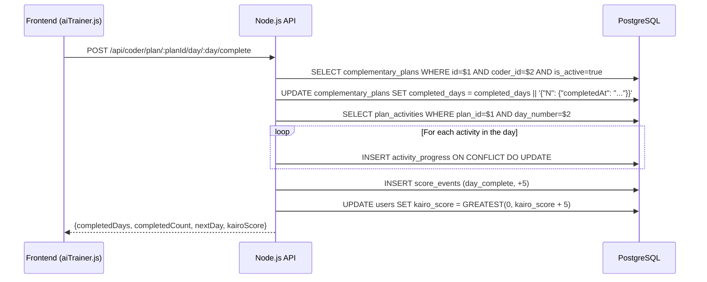
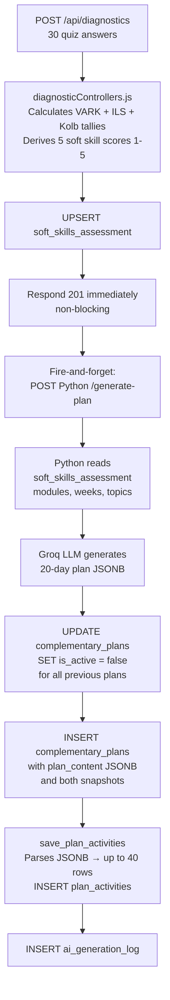
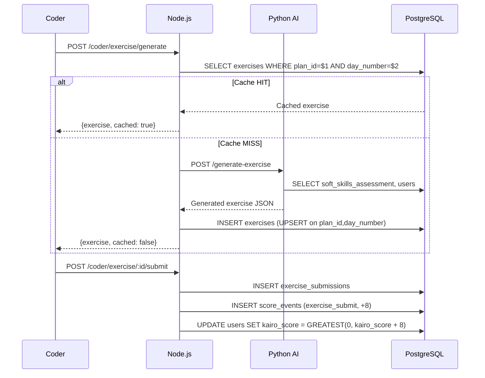

# Deliverable 2 — Progress Persistence Logic

## Database Technical Documentation — Kairo

### Integrative Project · RIWI · Clan Turing · March 2026

---

## Table of Contents

1. [Progress Persistence Logic](#1-progress-persistence-logic)
2. [Database Views](#2-database-views)
3. [Schema Evolution — Resolved Discrepancies](#3-schema-evolution--resolved-discrepancies)

---

## 1. Progress Persistence Logic

### 1.1 "Complete Day" Button Flow

When the coder clicks "Marcar día como completado" in the AI Trainer, the following chain executes:



**The core UPSERT for `activity_progress`:**

```sql
INSERT INTO activity_progress
    (activity_id, coder_id, completed, completed_at)
VALUES ($1, $2, true, NOW())
ON CONFLICT (activity_id, coder_id)
DO UPDATE SET
    completed    = true,
    completed_at = NOW()
```

The `UNIQUE(activity_id, coder_id)` constraint guarantees no duplicate rows. If a coder clicks "Complete" twice, the second call updates `completed_at` only — no duplicate is created.

`completed_days` in `complementary_plans` is stored as a JSONB object where keys are day numbers:

```json
{
  "1": { "completedAt": "2026-03-15T09:00:00.000Z" },
  "2": { "completedAt": "2026-03-15T10:30:00.000Z" },
  "5": { "completedAt": "2026-03-16T08:45:00.000Z" }
}
```

### 1.2 Plan Generation Flow (Snapshots)

When a coder completes onboarding:



The snapshots (`soft_skills_snapshot` and `moodle_status_snapshot`) are JSONB photographs of the coder's state at generation time. This allows historical comparison: "what was the coder's profile when this plan was created" vs "what is their current profile."

### 1.3 Exercise Submission Flow



### 1.4 Kairo Score Persistence

The scoring system uses two tables working together:

**`score_events`** — append-only log, never updated or deleted:

```sql
INSERT INTO score_events (coder_id, event_type, points, reference_id)
VALUES ($1, $2, $3, $4);
```

**`users.kairo_score`** — denormalized aggregate, updated atomically:

```sql
UPDATE users
SET kairo_score = GREATEST(0, kairo_score + $1)
WHERE id = $2
RETURNING kairo_score;
```

The `GREATEST(0, ...)` function ensures the score never goes negative. After every update, if the new score is below 20, a `risk_flag` is automatically inserted with `auto_detected = true`.

**Score event types and their triggers:**

| Event Type        | Points | Triggered By                             |
| ----------------- | ------ | ---------------------------------------- |
| `day_complete`    | +5     | `POST /coder/plan/:id/day/:day/complete` |
| `exercise_submit` | +8     | `POST /coder/exercise/:id/submit`        |
| `tl_approved`     | +15    | `POST /tl/submissions/:id/review`        |
| `plan_complete`   | +50    | When `completedCount >= 20`              |
| `inactivity`      | -3/day | Cron: 3+ days without activity           |

### 1.5 TL Review Flow

When a TL reviews a code submission:

```sql
-- 1. Verify the submission belongs to a coder in the TL's clan
SELECT es.id, es.coder_id, e.title
FROM exercise_submissions es
JOIN exercises e ON es.exercise_id = e.id
JOIN users u     ON es.coder_id = u.id
JOIN users tl    ON tl.id = $2
WHERE es.id = $1 AND u.clan = tl.clan;

-- 2. Save feedback
UPDATE exercise_submissions
SET tl_feedback_text = $1,
    reviewed_at      = NOW(),
    reviewed_by      = $2
WHERE id = $3
RETURNING id, tl_feedback_text, reviewed_at;

-- 3. Award points to coder
INSERT INTO score_events (coder_id, event_type, points, reference_id)
VALUES ($1, 'tl_approved', 15, $2);

UPDATE users SET kairo_score = GREATEST(0, kairo_score + 15) WHERE id = $1;

-- 4. Notify coder via SSE
INSERT INTO notifications (user_id, title, message, type, related_id)
VALUES ($1, 'Tu TL revisó tu ejercicio', $2, 'feedback', $3);
```

---

## 2. Database Views

### 2.1 `v_coder_dashboard` — Coder Progress Summary

```sql
CREATE OR REPLACE VIEW v_coder_dashboard AS
SELECT
    u.id                                                    AS coder_id,
    u.email,
    u.full_name,
    u.clan,
    u.kairo_score,
    m.name                                                  AS module_name,
    m.total_weeks,
    mp.current_week,
    mp.average_score                                        AS moodle_score,
    ssa.autonomy,
    ssa.time_management,
    ssa.problem_solving,
    ssa.communication,
    ssa.teamwork,
    ssa.learning_style,
    cp.id                                                   AS active_plan_id,
    cp.targeted_soft_skill,
    COUNT(DISTINCT pa.id)                                   AS total_activities,
    COUNT(DISTINCT ap.id) FILTER (WHERE ap.completed = true) AS completed_activities,
    ROUND(
        COUNT(DISTINCT ap.id) FILTER (WHERE ap.completed = true)::NUMERIC /
        NULLIF(COUNT(DISTINCT pa.id), 0) * 100, 2
    )                                                       AS completion_percentage
FROM users u
LEFT JOIN modules m                  ON m.id  = u.current_module_id
LEFT JOIN moodle_progress mp         ON mp.coder_id = u.id
LEFT JOIN soft_skills_assessment ssa ON ssa.coder_id = u.id
LEFT JOIN complementary_plans cp     ON cp.coder_id  = u.id AND cp.is_active = true
LEFT JOIN plan_activities pa         ON pa.plan_id   = cp.id
LEFT JOIN activity_progress ap       ON ap.activity_id = pa.id AND ap.coder_id = u.id
WHERE u.role = 'coder'
GROUP BY u.id, u.email, u.full_name, u.clan, u.kairo_score,
         m.name, m.total_weeks, mp.current_week, mp.average_score,
         ssa.autonomy, ssa.time_management, ssa.problem_solving,
         ssa.communication, ssa.teamwork, ssa.learning_style,
         cp.id, cp.targeted_soft_skill;
```

This view joins 7 tables to compute real-time progress. It works well for the current scale (dozens of coders per clan). For 200+ coders it would benefit from materialization or pre-aggregation.

### 2.2 `v_coder_risk_analysis` — Automated Risk Detection

```sql
CREATE OR REPLACE VIEW v_coder_risk_analysis AS
SELECT
    u.id                                             AS coder_id,
    u.full_name,
    u.clan,
    u.kairo_score,
    ssa.autonomy,
    ssa.problem_solving,
    mp.average_score,
    rf.risk_level                                    AS current_flag_level,
    CASE
        WHEN u.kairo_score < 20                      THEN 'critical'
        WHEN u.kairo_score < 35                      THEN 'high'
        WHEN ssa.autonomy <= 2 AND mp.average_score < 70 THEN 'high'
        WHEN ssa.autonomy <= 2 OR  mp.average_score < 70 THEN 'medium'
        ELSE 'low'
    END                                              AS calculated_risk_level,
    COUNT(DISTINCT se.id)                            AS total_score_events,
    MAX(ap.completed_at)                             AS last_activity_date
FROM users u
LEFT JOIN soft_skills_assessment ssa ON ssa.coder_id = u.id
LEFT JOIN moodle_progress mp         ON mp.coder_id  = u.id
LEFT JOIN risk_flags rf              ON rf.coder_id  = u.id AND rf.resolved = false
LEFT JOIN score_events se            ON se.coder_id  = u.id
LEFT JOIN activity_progress ap       ON ap.coder_id  = u.id AND ap.completed = true
WHERE u.role = 'coder'
GROUP BY u.id, u.full_name, u.clan, u.kairo_score,
         ssa.autonomy, ssa.problem_solving, mp.average_score, rf.risk_level
ORDER BY
    CASE WHEN u.kairo_score < 20 THEN 1
         WHEN u.kairo_score < 35 THEN 2
         ELSE 3 END,
    mp.average_score ASC;
```

The TL dashboard compares `current_flag_level` (last active `risk_flags` row) with `calculated_risk_level` (derived in real-time) to detect cases where auto-detection is outdated.

### 2.3 `v_tl_clan_overview` — TL Analytics Dashboard

```sql
CREATE OR REPLACE VIEW v_tl_clan_overview AS
SELECT
    u.clan,
    COUNT(DISTINCT u.id)                                    AS total_coders,
    COUNT(DISTINCT u.id) FILTER (WHERE u.first_login = false) AS completed_onboarding,
    ROUND(AVG(u.kairo_score), 0)                           AS avg_kairo_score,
    ROUND(AVG(mp.average_score), 1)                        AS avg_moodle_score,
    COUNT(DISTINCT rf.coder_id)
        FILTER (WHERE rf.risk_level IN ('high','critical')
                  AND rf.resolved = false)                  AS high_risk_count,
    COUNT(DISTINCT es.id) FILTER (WHERE es.reviewed_at IS NULL) AS pending_reviews,
    ROUND(AVG(ssa.autonomy), 1)                            AS avg_autonomy,
    ROUND(AVG(ssa.problem_solving), 1)                     AS avg_problem_solving
FROM users u
LEFT JOIN moodle_progress mp         ON mp.coder_id = u.id
LEFT JOIN soft_skills_assessment ssa ON ssa.coder_id = u.id
LEFT JOIN risk_flags rf              ON rf.coder_id  = u.id
LEFT JOIN exercise_submissions es    ON es.coder_id  = u.id
WHERE u.role = 'coder'
GROUP BY u.clan;
```

---

## 3. Schema Evolution — Resolved Discrepancies

The original database documentation (March 11, 2026) identified 6 discrepancies between the schema and the backend code. All have been resolved in the current production version.

### 3.1 ✅ `raw_answers` Column — RESOLVED

**Original issue:** `soft_skills_assessment` was missing the `raw_answers JSONB` column that the Node.js model was trying to insert.

**Resolution:** Column added via migration:

```sql
ALTER TABLE soft_skills_assessment ADD COLUMN IF NOT EXISTS raw_answers JSONB;
```

The column is now present in the production schema.

### 3.2 ✅ `clan` vs `clan_id` Field Name — RESOLVED

**Original issue:** Schema defined `clan_id VARCHAR(50)` but backend used `clan`.

**Resolution:** The column is named `clan` in the final schema. All controllers use `u.clan`. The FK constraint references `clans.id`:

```sql
CONSTRAINT fk_users_clan FOREIGN KEY (clan) REFERENCES public.clans(id)
```

### 3.3 ✅ `moodle_progress` UPSERT — RESOLVED

**Original issue:** `ON CONFLICT (coder_id)` didn't match the `UNIQUE(coder_id, module_id)` constraint.

**Resolution:** The Python service (`supabase_service.py`) handles this correctly using the full composite key. The Node.js controller reads from `moodle_progress` but does not write to it directly.

### 3.4 ✅ Missing Tables and Columns — RESOLVED

**Original issue:** Several tables and columns referenced in code did not exist in the schema: `weeks`, `performance_tests`, `targeted_soft_skill`, `current_module_id`, `learning_style_cache`, `is_critical`, `has_performance_test`.

**Resolution:** All were added to the final production schema. The current Supabase schema includes all these as confirmed by the live database export.

### 3.5 ✅ `completed_days` vs `activity_progress` — CLARIFIED

**Original issue:** Two different mechanisms tracked day completion.

**Clarification:** They serve different purposes and both are correct:

- `complementary_plans.completed_days` (JSONB) — fast lookup for "which days are done" used by the AI Trainer UI
- `activity_progress` (rows) — granular tracking of individual activities used by TL analytics

When `completeDay()` runs, it updates **both** atomically.

### 3.6 ✅ `exercises` Table — NEW, ADDED

**Original issue:** Exercises and exercise submissions did not exist in the original schema.

**Resolution:** Both `exercises` and `exercise_submissions` were added as part of the exercise system with `UNIQUE(plan_id, day_number)` caching constraint and TL review columns (`tl_feedback_text`, `reviewed_at`, `reviewed_by`).

### 3.7 ✅ `score_events` and `kairo_score` — NEW, ADDED

**Original issue:** No engagement scoring system existed.

**Resolution:** `score_events` table and `users.kairo_score` (DEFAULT 50) were added. Full audit trail of every point change, with automatic risk flag creation below threshold 20.

---

> **Document version:** 2.0 — Updated March 2026  
> **Author:** Miguel Calle — Database Architect  
> **Project:** Kairo · Riwi Bootcamp · Clan Turing  
> **Deliverable:** 2 of 3 — Progress Persistence Logic
