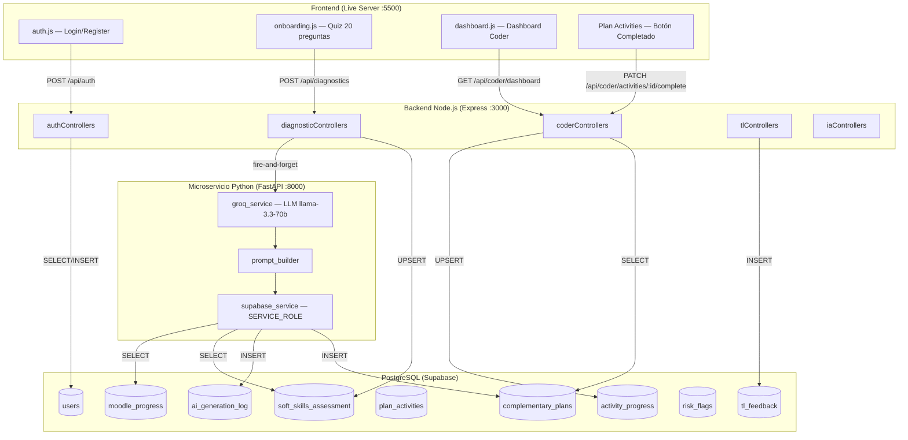

# Entregable 3 — Diagramas de Modelado

## Documentación Técnica de Base de Datos — Kairo

### Proyecto Integrador · RIWI · Clan Turing · Marzo 2026

---

## Tabla de Contenido

1. [Diagrama Entidad-Relación (ER)](#1-diagrama-entidad-relación-er)
2. [Diagrama de Componentes](#2-diagrama-de-componentes)
3. [Herramientas Utilizadas](#3-herramientas-utilizadas)
4. [Restricciones y Trabajo Pendiente](#4-restricciones-y-trabajo-pendiente)

---

## 1. Diagrama Entidad-Relación (ER)

**Herramienta:** [dbdiagram.io](https://dbdiagram.io)

El diagrama ER fue generado en dbdiagram.io a partir del DDL del `schema.sql`. Muestra las 14 tablas con sus columnas, tipos de dato, restricciones y relaciones (foreign keys). La tabla `users` está al centro como entidad principal de la que dependen casi todas las demás.

A continuación el código Mermaid equivalente para referencia y versionado:
```
Table users {
  id SERIAL [pk]
  email VARCHAR(100) [unique, not null]
  password VARCHAR(255) [not null]
  full_name VARCHAR(150) [not null]
  role VARCHAR(10) [not null, note: 'coder | tl']
  clan_id VARCHAR(50)
  first_login BOOLEAN [default: true]
  created_at TIMESTAMP [default: `now()`]
}

Table soft_skills_assessment {
  id SERIAL [pk]
  coder_id INT [unique, not null, ref: > users.id]
  autonomy INT [not null]
  time_management INT [not null]
  problem_solving INT [not null]
  communication INT [not null]
  teamwork INT [not null]
  learning_style VARCHAR(20) [not null, note: 'visual | auditory | kinesthetic | mixed']
  raw_answers JSONB
  assessed_at TIMESTAMP [default: `now()`]
}

Table modules {
  id SERIAL [pk]
  name VARCHAR(100) [not null]
  description TEXT
  total_weeks INT [not null]
  created_at TIMESTAMP [default: `now()`]
}

Table moodle_progress {
  id SERIAL [pk]
  coder_id INT [not null, ref: > users.id]
  module_id INT [not null, ref: > modules.id]
  current_week INT [not null]
  weeks_completed JSONB [default: '[]']
  struggling_topics TEXT
  average_score DECIMAL(5,2) [default: 0]
  updated_at TIMESTAMP [default: `now()`]

  indexes {
    (coder_id, module_id) [unique]
  }
}

Table topics {
  id SERIAL [pk]
  module_id INT [not null, ref: > modules.id]
  name VARCHAR(200) [not null]
  category VARCHAR(100)
}

Table coder_struggling_topics {
  id SERIAL [pk]
  coder_id INT [not null, ref: > users.id]
  topic_id INT [not null, ref: > topics.id]
  reported_at TIMESTAMP [default: `now()`]

  indexes {
    (coder_id, topic_id) [unique]
  }
}

Table complementary_plans {
  id SERIAL [pk]
  coder_id INT [not null, ref: > users.id]
  module_id INT [not null, ref: > modules.id]
  plan_content JSONB [not null]
  priority_level VARCHAR(10) [default: 'medium', note: 'low | medium | high']
  soft_skills_snapshot JSONB
  moodle_status_snapshot JSONB
  is_active BOOLEAN [default: true]
  generated_at TIMESTAMP [default: `now()`]
}

Table plan_activities {
  id SERIAL [pk]
  plan_id INT [not null, ref: > complementary_plans.id]
  day_number INT [not null]
  title VARCHAR(200) [not null]
  description TEXT
  estimated_time_minutes INT
  activity_type VARCHAR(20) [note: 'guided | semi_guided | autonomous']
  skill_focus VARCHAR(100)
}

Table activity_progress {
  id SERIAL [pk]
  activity_id INT [not null, ref: > plan_activities.id]
  coder_id INT [not null, ref: > users.id]
  completed BOOLEAN [default: false]
  reflection_text TEXT
  time_spent_minutes INT
  completed_at TIMESTAMP

  indexes {
    (activity_id, coder_id) [unique]
  }
}

Table evidence_submissions {
  id SERIAL [pk]
  activity_id INT [not null, ref: > plan_activities.id]
  coder_id INT [not null, ref: > users.id]
  file_url TEXT
  link_url TEXT
  description TEXT
  submitted_at TIMESTAMP [default: `now()`]
}

Table tl_feedback {
  id SERIAL [pk]
  coder_id INT [not null, ref: > users.id]
  tl_id INT [not null, ref: > users.id]
  plan_id INT [ref: > complementary_plans.id]
  feedback_text TEXT [not null]
  feedback_type VARCHAR(20) [note: 'weekly | activity | general']
  is_read BOOLEAN [default: false]
  created_at TIMESTAMP [default: `now()`]
}

Table risk_flags {
  id SERIAL [pk]
  coder_id INT [not null, ref: > users.id]
  risk_level VARCHAR(10) [not null, note: 'low | medium | high']
  reason TEXT [not null]
  auto_detected BOOLEAN [default: true]
  detected_at TIMESTAMP [default: `now()`]
  resolved BOOLEAN [default: false]
  resolved_at TIMESTAMP
}

Table ai_reports {
  id SERIAL [pk]
  target_type VARCHAR(10) [not null, note: 'coder | clan | cohort']
  target_id INT [not null, ref: > users.id]
  summary_text TEXT [not null]
  risk_level VARCHAR(10)
  recommendations TEXT
  generated_at TIMESTAMP [default: `now()`]
  viewed_by_tl BOOLEAN [default: false]
}

Table ai_generation_log {
  id SERIAL [pk]
  coder_id INT [ref: > users.id]
  agent_type VARCHAR(30) [not null, note: 'learning_plan | report_generator | risk_detector']
  input_payload JSONB [not null]
  output_payload JSONB [not null]
  model_name VARCHAR(100)
  execution_time_ms INT
  success BOOLEAN [default: true]
  error_message TEXT
  generated_at TIMESTAMP [default: `now()`]
}
```
---

## 2. Diagrama de Componentes

**Herramienta:** [mermaid.live](https://mermaid.live)

El diagrama de componentes muestra el flujo de datos completo entre las capas
del sistema: Frontend → Backend Node.js → Microservicio Python → Supabase
(PostgreSQL). Fue generado en mermaid.live.



---

## 3. Herramientas Utilizadas

| Diagrama                    | Herramienta  | URL                                  | Formato de exportación                            |
| --------------------------- | ------------ | ------------------------------------ | ------------------------------------------------- |
| **Diagrama ER**             | dbdiagram.io | [dbdiagram.io](https://dbdiagram.io) | PNG / PDF — generado desde el DDL de `schema.sql` |
| **Diagrama de Componentes** | mermaid.live | [mermaid.live](https://mermaid.live) | PNG / SVG — generado desde código Mermaid         |

**Instrucciones para regenerar:**

**Diagrama ER — dbdiagram.io:**

1. Ir a [dbdiagram.io](https://dbdiagram.io)
2. Pegar el DDL del `schema.sql` directamente en el editor DBML
3. Las relaciones se infieren de las FOREIGN KEY
4. Exportar como PNG o PDF

**Diagrama de Componentes — mermaid.live:**

1. Ir a [mermaid.live](https://mermaid.live)
2. Pegar el código Mermaid de la sección 2
3. Descargar como PNG/SVG

**Alternativa — Draw.io:**

1. Ir a [app.diagrams.net](https://app.diagrams.net)
2. Extra → Edit Diagram → pegar el código Mermaid
3. O importar desde SQL: Arrange → Insert → Advanced → SQL
4. Exportar como SVG o PNG con fondo transparente

---

## 4. Restricciones y Trabajo Pendiente

Lo que falta no es porque no sea importante sino porque no tenemos tiempo de
implementarlo todo bien este sprint:

- **Tabla `weeks`:** El controller y el servicio Python la referencian pero no
  existe. Hay que decidir si se crea como tabla independiente o se modela dentro
  de `modules` como JSONB.
- **Tabla `performance_tests`:** El controller del dashboard la consulta. Si el
  módulo de tests no va en este sprint, hay que quitar la query del controller
  para que no tire error.
- **Campo `targeted_soft_skill` en `complementary_plans`:** Python lo inserta,
  el controller lo lee, pero no está en el schema. Agregar con migración.
- **Campos extra en `users`:** `current_module_id`, `learning_style_cache`. El
  dashboard los necesita. Decidir si se agregan al schema o se obtienen de otras
  tablas con JOINs.
- **Campos extra en `modules`:** `is_critical`, `has_performance_test`. También
  falta decidir si van.

lo que importa es que el schema base es solido y las relaciones son correctas. Las discrepancias vienen de que el backend evolucionó mas rápido que el schema, lo cual pasa en todo proyecto de este tipo. La corrección no debería tomar mas de un día si nos sentamos Miguel y yo a alinear las migraciones.

Queda bastante por probar con datos reales, pero el punto de partida es solido y las rutas de datos están bien definidas para que tanto Cesar como Camilo puedan avanzar sin depender de cambios en la DB.

---

> **Documento generado por:** Miguel Calle — Database Architect  
> **Fecha:** 11 de Marzo de 2026  
> **Proyecto:** Kairo · RIWI · Clan Turing  
> **Entregable:** 3 de 3 — Diagramas de Modelado
