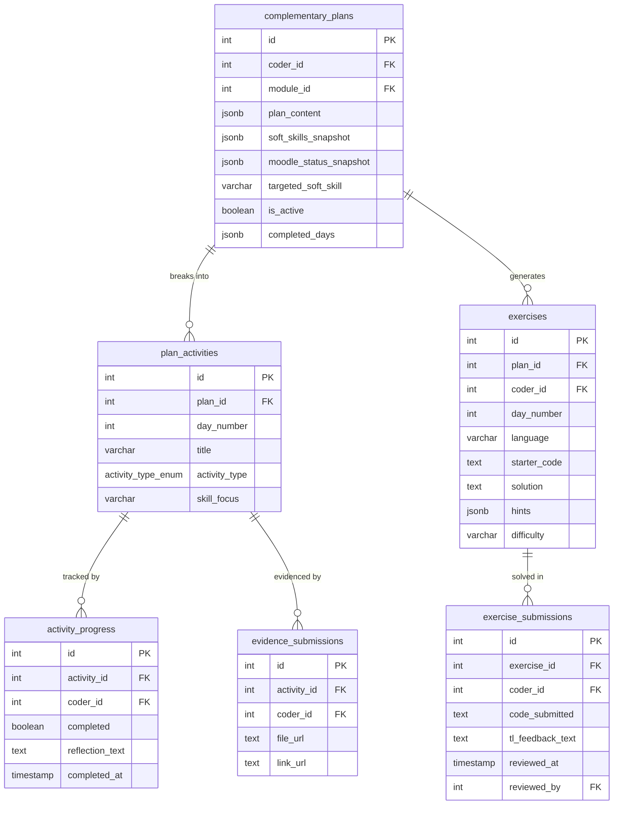
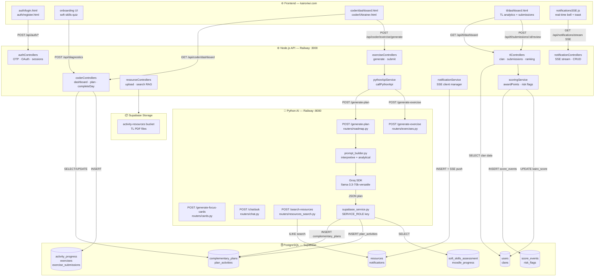
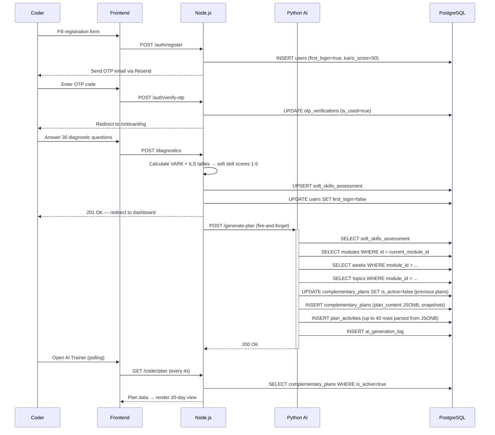
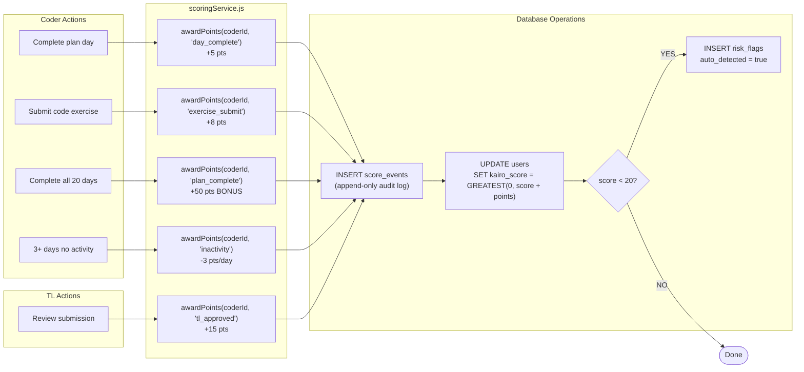
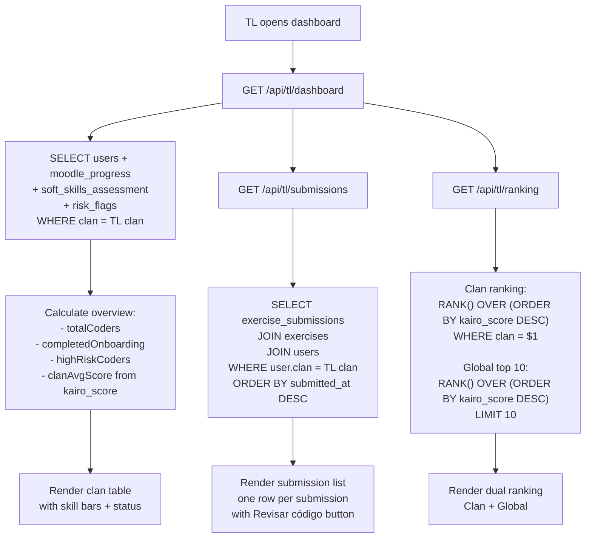
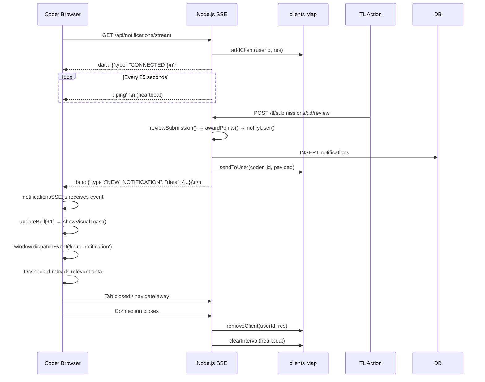

# Deliverable 3 — Modeling Diagrams

## Database Technical Documentation — Kairo

### Integrative Project · RIWI · Clan Turing · March 2026

---

## Table of Contents

1. [Full Entity-Relationship Diagram](#1-full-entity-relationship-diagram)
2. [System Component Diagram](#2-system-component-diagram)
3. [Data Flow Diagrams](#3-data-flow-diagrams)
4. [Tools Used](#4-tools-used)

---

## 1. Full Entity-Relationship Diagram

The following Mermaid ER diagram represents the complete production schema. Copy this code into [mermaid.live](https://mermaid.live) to render the full diagram.

### Block 1 — Identity & Academic

```mermaid
erDiagram
    users {
        int id PK
        varchar email UK
        varchar password
        varchar full_name
        role_enum role
        varchar clan FK
        boolean first_login
        boolean otp_verified
        int current_module_id FK
        varchar learning_style_cache
        boolean is_active
        int kairo_score
        timestamp created_at
    }
    clans {
        varchar id PK
        varchar name
    }
    user_profiles {
        int user_id PK_FK
        varchar phone
        varchar location
        text bio
        text github_url
        text linkedin_url
        jsonb skills
    }
    modules {
        int id PK
        varchar name
        int total_weeks
        boolean is_critical
        boolean has_performance_test
    }
    weeks {
        int id PK
        int module_id FK
        int week_number
        varchar name
        varchar difficulty_level
    }
    topics {
        int id PK
        int module_id FK
        varchar name
        varchar category
    }
    moodle_progress {
        int id PK
        int coder_id FK
        int module_id FK
        int current_week
        jsonb weeks_completed
        array struggling_topics
        numeric average_score
    }
    otp_verifications {
        int id PK
        varchar user_email FK
        varchar otp_code
        timestamp expires_at
        boolean is_used
    }

    users }o--|| clans : "belongs to"
    users ||--o| user_profiles : "has profile"
    users }o--|| modules : "studying"
    users ||--o{ otp_verifications : "verified by"
    modules ||--o{ weeks : "contains"
    modules ||--o{ topics : "covers"
    users ||--o{ moodle_progress : "tracks"
    modules ||--o{ moodle_progress : "measured in"
```

### Block 2 — AI Plans & Exercises



### Block 3 — Analytics & Feedback

```mermaid
erDiagram
    soft_skills_assessment {
        int id PK
        int coder_id FK_UK
        smallint autonomy
        smallint time_management
        smallint problem_solving
        smallint communication
        smallint teamwork
        learning_style_enum learning_style
        jsonb raw_answers
    }
    score_events {
        int id PK
        int coder_id FK
        varchar event_type
        int points
        int reference_id
        timestamp created_at
    }
    risk_flags {
        int id PK
        int coder_id FK
        risk_level_enum risk_level
        text reason
        boolean auto_detected
        boolean resolved
    }
    tl_feedback {
        int id PK
        int coder_id FK
        int tl_id FK
        int plan_id FK
        text feedback_text
        feedback_type_enum feedback_type
        boolean is_read
    }
    notifications {
        int id PK
        int user_id FK
        varchar title
        text message
        varchar type
        boolean is_read
    }
    resources {
        int id PK
        int module_id FK
        varchar title
        text storage_path
        text preview_text
        int uploaded_by FK
        varchar clan_id FK
        boolean is_active
    }
    performance_tests {
        int id PK
        int coder_id FK
        int module_id FK
        numeric score
        performance_status status
    }
    ai_generation_log {
        int id PK
        int coder_id FK
        ai_agent_enum agent_type
        jsonb input_payload
        jsonb output_payload
        varchar model_name
        int execution_time_ms
        boolean success
    }
```

---

## 2. System Component Diagram

This diagram shows the complete data flow between all system layers.



---

## 3. Data Flow Diagrams

### 3.1 Complete Onboarding → First Plan Flow



### 3.2 Kairo Score System Flow



### 3.3 TL Dashboard Data Flow



### 3.4 SSE Notification System



---

## 4. Tools Used

| Diagram           | Tool         | URL                                          | Export Format |
| ----------------- | ------------ | -------------------------------------------- | ------------- |
| ER Diagrams       | Mermaid      | [mermaid.live](https://mermaid.live)         | SVG / PNG     |
| Component Diagram | Mermaid      | [mermaid.live](https://mermaid.live)         | SVG / PNG     |
| Sequence Diagrams | Mermaid      | [mermaid.live](https://mermaid.live)         | SVG / PNG     |
| Alternative ER    | dbdiagram.io | [dbdiagram.io](https://dbdiagram.io)         | PNG / PDF     |
| Architecture      | Draw.io      | [app.diagrams.net](https://app.diagrams.net) | SVG / PNG     |

### How to regenerate diagrams

**Using mermaid.live:**

1. Go to [mermaid.live](https://mermaid.live)
2. Paste any of the Mermaid code blocks from this document
3. Click "Download PNG" or "Download SVG"

**Using dbdiagram.io for ER:**

1. Go to [dbdiagram.io](https://dbdiagram.io)
2. Import the DDL from the live Supabase schema export
3. Relationships are inferred from FOREIGN KEY constraints
4. Export as PDF or PNG

**Using Draw.io for architecture:**

1. Go to [app.diagrams.net](https://app.diagrams.net)
2. Extras → Edit Diagram → paste Mermaid code
3. Export as SVG with transparent background

---

> **Document version:** 2.0 — Updated March 2026  
> **Author:** Miguel Calle — Database Architect  
> **Project:** Kairo · Riwi Bootcamp · Clan Turing  
> **Deliverable:** 3 of 3 — Modeling Diagrams
