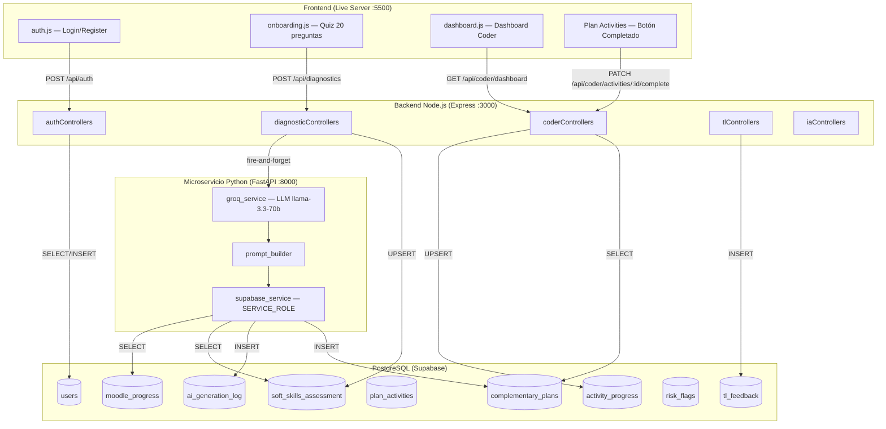

# Entregable 3 — Diagramas de Modelado

## Documentación Técnica de Base de Datos — Kairo

### Proyecto Integrador · RIWI · Clan Turing · Marzo 2026

---

## Tabla de Contenido

1. [Diagrama Entidad-Relación (ER)](#1-diagrama-entidad-relación-er)
2. [Diagrama de Componentes](#2-diagrama-de-componentes)
3. [Herramientas Utilizadas](#3-herramientas-utilizadas)
4. [Restricciones y Trabajo Pendiente](#4-restricciones-y-trabajo-pendiente)

---

## 1. Diagrama Entidad-Relación (ER)

**Herramienta:** [dbdiagram.io](https://dbdiagram.io)

El diagrama ER fue generado en dbdiagram.io a partir del DDL del `schema.sql`.
Muestra las 14 tablas con sus columnas, tipos de dato, restricciones y
relaciones (foreign keys). La tabla `users` está al centro como entidad
principal de la que dependen casi todas las demás.

A continuación el código Mermaid equivalente para referencia y versionado:

```mermaid
erDiagram
    users ||--o| soft_skills_assessment : "tiene evaluación"
    users ||--o{ moodle_progress : "tiene progreso"
    users ||--o{ complementary_plans : "tiene planes"
    users ||--o{ activity_progress : "completa actividades"
    users ||--o{ evidence_submissions : "sube evidencias"
    users ||--o{ tl_feedback : "recibe feedback"
    users ||--o{ risk_flags : "tiene alertas"
    users ||--o{ coder_struggling_topics : "reporta dificultad"
    users ||--o{ ai_generation_log : "genera logs IA"

    modules ||--o{ moodle_progress : "pertenece a"
    modules ||--o{ topics : "contiene temas"
    modules ||--o{ complementary_plans : "asociado a"

    topics ||--o{ coder_struggling_topics : "reportado en"

    complementary_plans ||--o{ plan_activities : "tiene actividades"
    complementary_plans ||--o{ tl_feedback : "recibe feedback"

    plan_activities ||--o{ activity_progress : "tiene progreso"
    plan_activities ||--o{ evidence_submissions : "tiene evidencias"

    users {
        int id PK
        varchar email UK
        varchar password
        varchar full_name
        role_enum role
        varchar clan_id
        boolean first_login
        timestamp created_at
    }

    soft_skills_assessment {
        int id PK
        int coder_id FK_UK
        int autonomy
        int time_management
        int problem_solving
        int communication
        int teamwork
        learning_style_enum learning_style
        timestamp assessed_at
    }

    modules {
        int id PK
        varchar name
        text description
        int total_weeks
        timestamp created_at
    }

    moodle_progress {
        int id PK
        int coder_id FK
        int module_id FK
        int current_week
        jsonb weeks_completed
        text_arr struggling_topics
        decimal average_score
        timestamp updated_at
    }

    topics {
        int id PK
        int module_id FK
        varchar name
        varchar category
    }

    coder_struggling_topics {
        int id PK
        int coder_id FK
        int topic_id FK
        timestamp reported_at
    }

    complementary_plans {
        int id PK
        int coder_id FK
        int module_id FK
        jsonb plan_content
        priority_level_enum priority_level
        jsonb soft_skills_snapshot
        jsonb moodle_status_snapshot
        boolean is_active
        timestamp generated_at
    }

    plan_activities {
        int id PK
        int plan_id FK
        int day_number
        varchar title
        text description
        int estimated_time_minutes
        activity_type_enum activity_type
        varchar skill_focus
    }

    activity_progress {
        int id PK
        int activity_id FK
        int coder_id FK
        boolean completed
        text reflection_text
        int time_spent_minutes
        timestamp completed_at
    }

    evidence_submissions {
        int id PK
        int activity_id FK
        int coder_id FK
        text file_url
        text link_url
        text description
        timestamp submitted_at
    }

    tl_feedback {
        int id PK
        int coder_id FK
        int tl_id FK
        int plan_id FK
        text feedback_text
        feedback_type_enum feedback_type
        boolean is_read
        timestamp created_at
    }

    risk_flags {
        int id PK
        int coder_id FK
        risk_level_enum risk_level
        text reason
        boolean auto_detected
        timestamp detected_at
        boolean resolved
        timestamp resolved_at
    }

    ai_reports {
        int id PK
        report_target_enum target_type
        int target_id
        text summary_text
        risk_level_enum risk_level
        text recommendations
        timestamp generated_at
        boolean viewed_by_tl
    }

    ai_generation_log {
        int id PK
        int coder_id FK
        ai_agent_enum agent_type
        jsonb input_payload
        jsonb output_payload
        varchar model_name
        int execution_time_ms
        boolean success
        text error_message
        timestamp generated_at
    }
```

---

## 2. Diagrama de Componentes

**Herramienta:** [mermaid.live](https://mermaid.live)

El diagrama de componentes muestra el flujo de datos completo entre las capas
del sistema: Frontend → Backend Node.js → Microservicio Python → Supabase
(PostgreSQL). Fue generado en mermaid.live.



---

## 3. Herramientas Utilizadas

| Diagrama                    | Herramienta  | URL                                  | Formato de exportación                            |
| --------------------------- | ------------ | ------------------------------------ | ------------------------------------------------- |
| **Diagrama ER**             | dbdiagram.io | [dbdiagram.io](https://dbdiagram.io) | PNG / PDF — generado desde el DDL de `schema.sql` |
| **Diagrama de Componentes** | mermaid.live | [mermaid.live](https://mermaid.live) | PNG / SVG — generado desde código Mermaid         |

**Instrucciones para regenerar:**

**Diagrama ER — dbdiagram.io:**

1. Ir a [dbdiagram.io](https://dbdiagram.io)
2. Pegar el DDL del `schema.sql` directamente en el editor DBML
3. Las relaciones se infieren de las FOREIGN KEY
4. Exportar como PNG o PDF

**Diagrama de Componentes — mermaid.live:**

1. Ir a [mermaid.live](https://mermaid.live)
2. Pegar el código Mermaid de la sección 2
3. Descargar como PNG/SVG

**Alternativa — Draw.io:**

1. Ir a [app.diagrams.net](https://app.diagrams.net)
2. Extra → Edit Diagram → pegar el código Mermaid
3. O importar desde SQL: Arrange → Insert → Advanced → SQL
4. Exportar como SVG o PNG con fondo transparente

---

## 4. Restricciones y Trabajo Pendiente

Lo que falta no es porque no sea importante sino porque no tenemos tiempo de
implementarlo todo bien este sprint:

- **Tabla `weeks`:** El controller y el servicio Python la referencian pero no
  existe. Hay que decidir si se crea como tabla independiente o se modela dentro
  de `modules` como JSONB.
- **Tabla `performance_tests`:** El controller del dashboard la consulta. Si el
  módulo de tests no va en este sprint, hay que quitar la query del controller
  para que no tire error.
- **Campo `targeted_soft_skill` en `complementary_plans`:** Python lo inserta,
  el controller lo lee, pero no está en el schema. Agregar con migración.
- **Campos extra en `users`:** `current_module_id`, `learning_style_cache`. El
  dashboard los necesita. Decidir si se agregan al schema o se obtienen de otras
  tablas con JOINs.
- **Campos extra en `modules`:** `is_critical`, `has_performance_test`. También
  falta decidir si van.

En resumen, lo que importa es que el schema base es solido y las relaciones son
correctas. Las discrepancias vienen de que el backend evolucionó mas rápido que
el schema, lo cual pasa en todo proyecto de este tipo. La corrección no debería
tomar mas de un día si nos sentamos Miguel y yo a alinear las migraciones.

Queda bastante por probar con datos reales, pero el punto de partida es solido y
las rutas de datos están bien definidas para que tanto Cesar como Camilo puedan
avanzar sin depender de cambios en la DB.

---

> **Documento generado por:** Miguel Calle — Database Architect  
> **Fecha:** 11 de Marzo de 2026  
> **Proyecto:** Kairo · RIWI · Clan Turing  
> **Entregable:** 3 de 3 — Diagramas de Modelado
