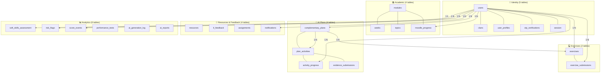

# Database Model Documentation — Kairo

## AI-Powered Personalized Learning Platform

### Integrative Project · RIWI · Clan Turing · March 2026

---

## Table of Contents

1. [General Description](#1-general-description)
2. [Model Architecture](#2-model-architecture)
3. [Main Entities](#3-main-entities)
4. [Entity Relationships](#4-entity-relationships)
5. [Indexes and Optimizations](#5-indexes-and-optimizations)
6. [Triggers and Functions](#6-triggers-and-functions)
7. [Recommended Views](#7-recommended-views)
8. [Useful Queries](#8-useful-queries)

---

## 1. General Description

### Project Context

Kairo's database supports an AI-powered educational web application that generates personalized learning paths for Riwi bootcamp students. The system enables:

- **Soft skills diagnosis** via a 30-question VARK + ILS + Kolb assessment
- **Academic progress tracking** from Moodle (scores, weeks completed, struggling topics)
- **AI plan generation** — 20-day personalized plans via Groq's `llama-3.3-70b-versatile`
- **Exercise system** — daily code exercises with Monaco editor, TL review, and cached generation
- **Engagement scoring** — Kairo Score tracks platform activity independent of academic grades
- **TL analytics** — risk detection, clan rankings, submission review dashboard
- **Real-time notifications** — SSE-based delivery with persistent storage

### Technology

- **Database Engine:** PostgreSQL 14+ on Supabase
- **Justification:** Native JSONB support for flexible AI-generated content, TEXT arrays for topic lists, GIN indexes for full-text search, custom ENUM types for data integrity
- **Access Pattern:** Node.js uses `pg.Pool` with connection strings. Python uses the Supabase client with `SERVICE_ROLE` key (bypasses RLS for plan generation)

---

## 2. Model Architecture

The 22 tables are organized into 6 functional groups:



---

## 3. Main Entities

### 3.1 `users` — System Users

**Purpose:** Central table for authentication and profile data. The only table referenced by almost every other table via FK.

| Column                 | Type                  | Description                                       |
| ---------------------- | --------------------- | ------------------------------------------------- |
| `id`                   | SERIAL PK             | Auto-increment                                    |
| `email`                | VARCHAR UNIQUE        | Institutional email                               |
| `password`             | VARCHAR(255)          | bcrypt hash. OAuth users: `oauth_<provider>_<id>` |
| `full_name`            | VARCHAR               | Display name                                      |
| `role`                 | role_enum             | `coder` or `tl`                                   |
| `clan`                 | VARCHAR FK → clans    | `'turing'`, `'tesla'`, `'mccarthy'`               |
| `first_login`          | BOOLEAN DEFAULT true  | Onboarding gate                                   |
| `otp_verified`         | BOOLEAN DEFAULT false | Email verification                                |
| `current_module_id`    | INT FK → modules      | Active module (default: 4)                        |
| `learning_style_cache` | VARCHAR               | Cached from soft_skills_assessment                |
| `is_active`            | BOOLEAN DEFAULT true  | Soft-delete                                       |
| `kairo_score`          | INT DEFAULT 50        | Platform engagement score                         |
| `created_at`           | TIMESTAMP             |                                                   |

**Relationships:** 1:N with `soft_skills_assessment`, `moodle_progress`, `complementary_plans`, `activity_progress`, `exercises`, `exercise_submissions`, `score_events`, `risk_flags`, `notifications`, `tl_feedback` (as both sender and receiver)

---

### 3.2 `soft_skills_assessment` — Onboarding Diagnostic

**Purpose:** Stores the results of the 30-question soft skills assessment completed during onboarding. The Python AI reads this table to personalize every plan it generates.

| Column            | Type                | Description                                          |
| ----------------- | ------------------- | ---------------------------------------------------- |
| `coder_id`        | INT UNIQUE FK       | One assessment per coder                             |
| `autonomy`        | SMALLINT(1-5)       | VARK + ILS derived score                             |
| `time_management` | SMALLINT(1-5)       |                                                      |
| `problem_solving` | SMALLINT(1-5)       |                                                      |
| `communication`   | SMALLINT(1-5)       |                                                      |
| `teamwork`        | SMALLINT(1-5)       |                                                      |
| `learning_style`  | learning_style_enum | visual / auditory / kinesthetic / read_write / mixed |
| `raw_answers`     | JSONB               | Original quiz responses for audit/replay             |
| `assessed_at`     | TIMESTAMP           |                                                      |

---

### 3.3 `complementary_plans` — AI-Generated Plans

**Purpose:** The heart of the system. Stores the full 20-day learning plan as JSONB, along with coder state snapshots and daily completion tracking.

| Column                   | Type               | Description                                              |
| ------------------------ | ------------------ | -------------------------------------------------------- |
| `plan_content`           | JSONB              | Full plan structure with 4 weeks × 5 days × 2 activities |
| `soft_skills_snapshot`   | JSONB              | Coder's skill profile at generation time                 |
| `moodle_status_snapshot` | JSONB              | Moodle progress at generation time                       |
| `targeted_soft_skill`    | VARCHAR            | Weakest skill the plan targets                           |
| `is_active`              | BOOLEAN            | Only one active plan per coder                           |
| `completed_days`         | JSONB DEFAULT '{}' | `{"1": {"completedAt": "..."}, ...}`                     |

**`plan_content` structure:**

```json
{
  "plan_type": "interpretive",
  "targeted_soft_skill": "problem_solving",
  "learning_style_applied": "mixed",
  "summary": "...",
  "weeks": [
    {
      "week_number": 1,
      "focus": "Week theme",
      "days": [
        {
          "day": 1,
          "technical_activity": {
            "title": "...",
            "description": "...",
            "duration_minutes": 45,
            "difficulty": "intermediate",
            "resources": ["https://..."]
          },
          "soft_skill_activity": {
            "title": "...",
            "description": "...",
            "duration_minutes": 20,
            "skill": "problem_solving",
            "reflection_prompt": "..."
          }
        }
      ]
    }
  ]
}
```

---

### 3.4 `exercises` — Daily Code Exercises

**Purpose:** Cached AI-generated exercises per plan day. The `UNIQUE(plan_id, day_number)` constraint ensures the LLM is called only once per day — subsequent requests return the cached version.

**Supported languages:** `sql`, `python`, `javascript`, `html`

**`hints` JSONB structure:**

```json
[
  "Consider using a LEFT JOIN to include rows without matches",
  "The GROUP BY clause must include all non-aggregated columns",
  "Check the WHERE clause — it filters before grouping"
]
```

---

### 3.5 `score_events` — Kairo Score Audit Log

**Purpose:** Immutable append-only log of every point change. `users.kairo_score` is the denormalized aggregate kept in sync after every INSERT.

| Event             | Points | Triggered by                        |
| ----------------- | ------ | ----------------------------------- |
| `day_complete`    | +5     | Coder marks plan day complete       |
| `exercise_submit` | +8     | Coder submits code exercise         |
| `tl_approved`     | +15    | TL reviews and provides feedback    |
| `plan_complete`   | +50    | All 20 days completed               |
| `inactivity`      | -3/day | Automated: 3+ days without activity |

Score floors at 0 via `GREATEST(0, kairo_score + points)`. Auto risk flag created if score drops below 20.

---

### 3.6 `resources` — TL-Uploaded PDFs

**Purpose:** Stores metadata for PDFs uploaded by TLs to Supabase Storage. Used by the RAG system to surface relevant resources in the AI Trainer for each day's topic.

`clan_id` FK ensures strict isolation — coders only see resources uploaded by their own TL.

`preview_text` stores extracted text from the PDF for ILIKE-based search (semantic search via pgvector is implemented but optional).

---

## 4. Entity Relationships

### 4.1 One-to-Many (1:N)

| Parent                | Child                    | Description                                   |
| --------------------- | ------------------------ | --------------------------------------------- |
| `users`               | `soft_skills_assessment` | One assessment per coder (enforced UNIQUE)    |
| `users`               | `moodle_progress`        | Progress per module (UNIQUE per coder+module) |
| `users`               | `complementary_plans`    | Multiple plans over time, one active          |
| `users`               | `activity_progress`      | Completion records per activity               |
| `users`               | `exercises`              | Exercises generated for their plans           |
| `users`               | `exercise_submissions`   | Code submissions                              |
| `users`               | `score_events`           | Point history                                 |
| `users`               | `risk_flags`             | Risk alerts                                   |
| `users`               | `notifications`          | SSE notification queue                        |
| `modules`             | `weeks`                  | Module structure                              |
| `modules`             | `topics`                 | Topic catalog                                 |
| `complementary_plans` | `plan_activities`        | Up to 40 parsed activity rows                 |
| `complementary_plans` | `exercises`              | One exercise cached per day                   |
| `plan_activities`     | `activity_progress`      | Completion tracking                           |
| `exercises`           | `exercise_submissions`   | Code submissions for TL review                |

### 4.2 Self-referential Relationships

**`tl_feedback`** has two FKs to `users`:

- `coder_id` → coder who **receives** the feedback
- `tl_id` → TL who **sends** the feedback

**`exercise_submissions`** has:

- `coder_id` → coder who **submitted** the code
- `reviewed_by` → TL who **reviewed** the submission

### 4.3 Many-to-Many (N:M)

| Entity 1         | Junction Table         | Entity 2          | Description                             |
| ---------------- | ---------------------- | ----------------- | --------------------------------------- |
| `users` (coders) | `exercise_submissions` | `exercises`       | Each coder can submit for each exercise |
| `users` (coders) | `activity_progress`    | `plan_activities` | Each coder tracks progress per activity |

---

## 5. Indexes and Optimizations

### Unique Constraints

```sql
-- Ensures no duplicate email registrations
ALTER TABLE users ADD CONSTRAINT uk_email UNIQUE (email);

-- One soft skills assessment per coder
ALTER TABLE soft_skills_assessment ADD CONSTRAINT uk_ssa_coder UNIQUE (coder_id);

-- One Moodle progress row per coder per module
ALTER TABLE moodle_progress ADD CONSTRAINT uk_moodle UNIQUE (coder_id, module_id);

-- One progress record per activity per coder
ALTER TABLE activity_progress ADD CONSTRAINT uk_progress UNIQUE (activity_id, coder_id);

-- Exercise cache key — LLM called only once per plan day
ALTER TABLE exercises ADD CONSTRAINT uk_exercise_cache UNIQUE (plan_id, day_number);
```

### Performance Indexes

```sql
-- Most frequent: find coder's active plan
CREATE INDEX idx_plans_coder_active  ON complementary_plans(coder_id, is_active);

-- TL: find all submissions from their clan
CREATE INDEX idx_submissions_coder   ON exercise_submissions(coder_id);
CREATE INDEX idx_submissions_review  ON exercise_submissions(reviewed_at) WHERE reviewed_at IS NULL;

-- Score: fast lookup for ranking
CREATE INDEX idx_score_events_coder  ON score_events(coder_id);
CREATE INDEX idx_users_kairo_score   ON users(kairo_score DESC) WHERE role = 'coder';

-- Notifications: unread count
CREATE INDEX idx_notif_user_unread   ON notifications(user_id, is_read) WHERE is_read = false;

-- Resources: clan-filtered search
CREATE INDEX idx_resources_clan      ON resources(clan_id, is_active) WHERE is_active = true;

-- Risk flags: active flags per coder
CREATE INDEX idx_risk_active         ON risk_flags(coder_id, resolved) WHERE resolved = false;
```

### JSONB Indexes

```sql
-- Full-text search on resource preview text (Spanish stemming)
CREATE INDEX idx_resources_fts ON resources
    USING GIN (to_tsvector('spanish', COALESCE(preview_text, '')));

-- Plan content search (for analytics)
CREATE INDEX idx_plans_content ON complementary_plans USING GIN (plan_content);
```

---

## 6. Triggers and Functions

### 6.1 Auto-deactivate Previous Plans

The Python service handles this explicitly in `supabase_service.py → deactivate_plans()`, but a trigger provides a safety net:

```sql
CREATE OR REPLACE FUNCTION deactivate_old_plans()
RETURNS TRIGGER AS $$
BEGIN
    UPDATE complementary_plans
    SET is_active = false
    WHERE coder_id = NEW.coder_id
      AND id != NEW.id
      AND is_active = true;
    RETURN NEW;
END;
$$ LANGUAGE plpgsql;

CREATE TRIGGER trg_deactivate_old_plans
    AFTER INSERT ON complementary_plans
    FOR EACH ROW
    WHEN (NEW.is_active = true)
    EXECUTE FUNCTION deactivate_old_plans();
```

### 6.2 Auto Risk Flag on Low Score

Handled in `scoringService.js → _autoRiskFlag()` after every score update. The database trigger provides a backup:

```sql
CREATE OR REPLACE FUNCTION check_risk_threshold()
RETURNS TRIGGER AS $$
BEGIN
    IF NEW.kairo_score < 20 AND OLD.kairo_score >= 20 THEN
        INSERT INTO risk_flags (coder_id, risk_level, reason, auto_detected)
        VALUES (
            NEW.id,
            CASE WHEN NEW.kairo_score < 10 THEN 'critical' ELSE 'high' END,
            'Kairo score dropped below threshold: ' || NEW.kairo_score || ' pts',
            true
        )
        ON CONFLICT DO NOTHING;
    END IF;
    RETURN NEW;
END;
$$ LANGUAGE plpgsql;

CREATE TRIGGER trg_auto_risk_flag
    AFTER UPDATE OF kairo_score ON users
    FOR EACH ROW
    EXECUTE FUNCTION check_risk_threshold();
```

### 6.3 Update `updated_at` Timestamps

```sql
CREATE OR REPLACE FUNCTION update_updated_at()
RETURNS TRIGGER AS $$
BEGIN
    NEW.updated_at = CURRENT_TIMESTAMP;
    RETURN NEW;
END;
$$ LANGUAGE plpgsql;

CREATE TRIGGER trg_moodle_updated_at
    BEFORE UPDATE ON moodle_progress
    FOR EACH ROW EXECUTE FUNCTION update_updated_at();
```

---

## 7. Recommended Views

### 7.1 Coder Dashboard View

```sql
CREATE OR REPLACE VIEW v_coder_dashboard AS
SELECT
    u.id              AS coder_id,
    u.email,
    u.full_name,
    u.clan,
    u.kairo_score,
    m.name            AS module_name,
    m.total_weeks,
    mp.current_week,
    mp.average_score  AS moodle_score,
    ssa.autonomy, ssa.time_management, ssa.problem_solving,
    ssa.communication, ssa.teamwork, ssa.learning_style,
    cp.id             AS active_plan_id,
    cp.targeted_soft_skill,
    COUNT(DISTINCT pa.id)                                      AS total_activities,
    COUNT(DISTINCT ap.id) FILTER (WHERE ap.completed = true)   AS completed_activities,
    ROUND(
        COUNT(DISTINCT ap.id) FILTER (WHERE ap.completed = true)::NUMERIC
        / NULLIF(COUNT(DISTINCT pa.id), 0) * 100, 2
    )                 AS completion_pct
FROM users u
LEFT JOIN modules m                  ON m.id  = u.current_module_id
LEFT JOIN moodle_progress mp         ON mp.coder_id  = u.id
LEFT JOIN soft_skills_assessment ssa ON ssa.coder_id = u.id
LEFT JOIN complementary_plans cp     ON cp.coder_id  = u.id AND cp.is_active = true
LEFT JOIN plan_activities pa         ON pa.plan_id   = cp.id
LEFT JOIN activity_progress ap       ON ap.activity_id = pa.id AND ap.coder_id = u.id
WHERE u.role = 'coder'
GROUP BY u.id, u.email, u.full_name, u.clan, u.kairo_score,
         m.name, m.total_weeks, mp.current_week, mp.average_score,
         ssa.autonomy, ssa.time_management, ssa.problem_solving,
         ssa.communication, ssa.teamwork, ssa.learning_style,
         cp.id, cp.targeted_soft_skill;
```

### 7.2 Risk Analysis View

```sql
CREATE OR REPLACE VIEW v_coder_risk_analysis AS
SELECT
    u.id, u.full_name, u.clan, u.kairo_score,
    ssa.autonomy, ssa.problem_solving,
    mp.average_score,
    rf.risk_level            AS current_flag,
    CASE
        WHEN u.kairo_score < 20                              THEN 'critical'
        WHEN u.kairo_score < 35                              THEN 'high'
        WHEN ssa.autonomy <= 2 AND mp.average_score < 70     THEN 'high'
        WHEN ssa.autonomy <= 2 OR  mp.average_score < 70     THEN 'medium'
        ELSE 'low'
    END                      AS calculated_risk,
    MAX(ap.completed_at)     AS last_activity
FROM users u
LEFT JOIN soft_skills_assessment ssa ON ssa.coder_id = u.id
LEFT JOIN moodle_progress mp         ON mp.coder_id  = u.id
LEFT JOIN risk_flags rf              ON rf.coder_id  = u.id AND rf.resolved = false
LEFT JOIN activity_progress ap       ON ap.coder_id  = u.id AND ap.completed = true
WHERE u.role = 'coder'
GROUP BY u.id, u.full_name, u.clan, u.kairo_score,
         ssa.autonomy, ssa.problem_solving, mp.average_score, rf.risk_level
ORDER BY u.kairo_score ASC;
```

---

## 8. Useful Queries

### Get coder's full dashboard data

```sql
SELECT * FROM v_coder_dashboard WHERE coder_id = $1;
```

### Get TL's clan overview with scores

```sql
SELECT
    u.id, u.full_name, u.kairo_score, u.first_login,
    mp.average_score, mp.current_week,
    ssa.autonomy, ssa.time_management, ssa.problem_solving,
    ssa.communication, ssa.teamwork, ssa.learning_style,
    rf.risk_level
FROM users u
LEFT JOIN moodle_progress        mp  ON mp.coder_id = u.id
LEFT JOIN soft_skills_assessment ssa ON ssa.coder_id = u.id
LEFT JOIN risk_flags             rf  ON rf.coder_id  = u.id AND rf.resolved = false
WHERE u.role = 'coder' AND u.clan = $1
ORDER BY u.full_name ASC;
```

### Get clan + global Kairo Score ranking

```sql
-- Clan ranking
SELECT full_name, kairo_score,
       RANK() OVER (ORDER BY kairo_score DESC) AS rank
FROM users
WHERE role = 'coder' AND clan = $1 AND is_active = true;

-- Global top 10
SELECT full_name, clan, kairo_score,
       RANK() OVER (ORDER BY kairo_score DESC) AS rank
FROM users
WHERE role = 'coder' AND is_active = true
ORDER BY kairo_score DESC LIMIT 10;
```

### Get pending code submissions for TL

```sql
SELECT
    es.id, es.code_submitted, es.submitted_at,
    e.title, e.language, e.difficulty, e.day_number, e.expected_output,
    u.full_name AS coder_name
FROM exercise_submissions es
JOIN exercises e ON es.exercise_id = e.id
JOIN users u     ON es.coder_id   = u.id
JOIN users tl    ON tl.id         = $1
WHERE u.clan = tl.clan
  AND es.reviewed_at IS NULL
ORDER BY es.submitted_at DESC;
```

### Get coders at risk (ordered by severity)

```sql
SELECT
    u.full_name, u.kairo_score, u.clan,
    rf.risk_level, rf.reason, rf.detected_at,
    ssa.autonomy, mp.average_score
FROM users u
JOIN risk_flags rf            ON rf.coder_id = u.id AND rf.resolved = false
LEFT JOIN soft_skills_assessment ssa ON ssa.coder_id = u.id
LEFT JOIN moodle_progress mp  ON mp.coder_id = u.id
WHERE u.clan = $1
ORDER BY
    CASE rf.risk_level
        WHEN 'critical' THEN 1
        WHEN 'high'     THEN 2
        WHEN 'medium'   THEN 3
        ELSE 4
    END;
```

### Get score history for a specific coder

```sql
SELECT
    event_type,
    points,
    reference_id,
    created_at,
    SUM(points) OVER (ORDER BY created_at ROWS UNBOUNDED PRECEDING) AS running_total
FROM score_events
WHERE coder_id = $1
ORDER BY created_at DESC
LIMIT 20;
```

---

> **Document version:** 2.0 — Updated March 2026  
> **Authors:** Miguel Calle (Database Architect), Héctor Rios (Backend Lead)  
> **Project:** Kairo · Riwi Bootcamp · Clan Turing  
> **Database:** PostgreSQL 14+ on Supabase | 22 tables | 8 ENUM types | 2 views
